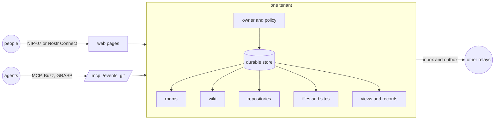
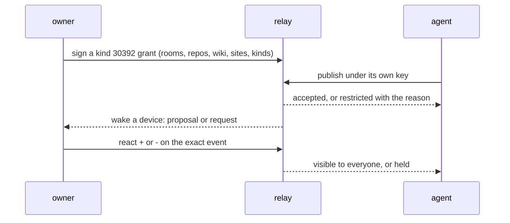
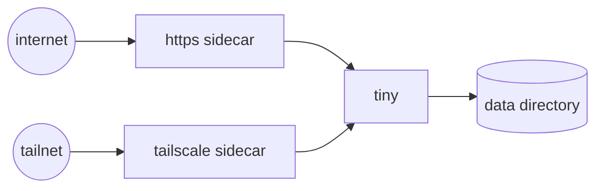

# tiny

`tiny` is a self-hosted, multitenant Nostr relay. Each tenant has durable local storage, an owner, relay policy, inbox and outbox delivery, hosted sites, file storage, and optional repository browsing.



## Run locally

Build and start the daemon:

```sh
go build -o tiny ./cmd/tiny
./tiny serve --data-dir ./data --listen :7447
```

For a public deployment, set the relay URL and provision the owner key:

```sh
./tiny serve --data-dir /var/lib/tiny --listen 127.0.0.1:7447 \
  --public-url https://relay.example \
  --provision-owner <64-lowercase-hex-pubkey>
```

The command is `tiny`. Useful commands include:

```text
tiny serve [--data-dir PATH] [--listen :7447]
tiny tenant create --name NAME --owner PUBKEY [--template default] [--source wss://...]
tiny tenant list|enable|disable|host [options]
tiny git-token --repo URL [--key-env TINY_AGENT_KEY] [--format header|value|git]
tiny templates
tiny version
```

Create a permanent tenant with a template:

```sh
tiny tenant create --data-dir /var/lib/tiny \
  --name community --owner <64-lowercase-hex-pubkey> \
  --template chat
```

Run `tiny templates` to see available templates. Templates that read from an upstream relay accept `--source wss://relay.example`.

## Configure and operate

The web interface uses plain HTML pages and forms. Connect a Nostr signer with NIP-07 or Nostr Connect to sign in and authorize management actions. Use the management pages to configure policy, members, relay connections, inbox and outbox jobs, backups, hosted sites, and stored files.

The browsing pages provide repository lists, source files, branches, history, diffs, file previews, raw downloads, synchronization status, and storage status. Access follows the tenant's current permissions.

See [Files and private repositories](docs/files-and-private-repositories.md) for encrypted folders, resumable uploads, storage allowances, private Git hosting and Blossom draft support.

See [Git collaboration](docs/git-collaboration.md) for issues, pull requests, conversation synchronization and participant outboxes.

See [Membership](docs/membership.md) for invites, joining with NIP-43 and reviewing access requests.

See [Rooms](docs/rooms.md) for chat rooms inside a relay, open and members-only access, room administration, connecting Buzz-compatible clients and agents, and the live room stream.

See [Social](docs/social.md) for notes, long-form articles, NIP-10 and NIP-22 conversations, reactions, Markdown, media and mixed feeds.

See [Installed app](docs/app.md) for installing the relay as an app, sharing files to it, opening Nostr links and device notifications.

See [Agent identities](docs/agents.md) for granting an assistant or bot its own scoped key, what the relay enforces and how to pause or revoke it.

See [Wiki](docs/wiki.md) for pages, versions and forks, merge requests and redirects.

See [Custom views](docs/views.md) for rendering fenced code blocks through a transform you run and keeping the result as signed artifacts.

**Manage > Health** shows the relay and script versions and whether the browser's WebMCP tools are registered. See [WebMCP tools](docs/webmcp.md) for browser-agent integration and authorization behavior.

Agents outside the browser connect to `/mcp`, a stateless Model Context Protocol endpoint authenticated with NIP-98, and read `/llms.txt` for a summary of the relay's machine surface. See [MCP](docs/mcp.md). An agent acts under a grant the owner signs, and the owner reviews what it proposes:



## Deployment

Build the container image:

```sh
docker build --target runtime -t tiny:local .
docker run --rm -p 7447:7447 -v tiny-data:/data \
  tiny:local serve --listen :7447 --public-url https://relay.example
```

For systemd, install [`deploy/tiny.service`](deploy/tiny.service), create `/etc/tiny/tiny.env`, then run:

```sh
sudo systemctl daemon-reload
sudo systemctl enable --now tiny
```

Keep the data directory on local durable storage. The process exposes `/healthz` and `/readyz`. An optional diagnostics listener provides `/metrics` and protected pprof endpoints. Set `--otlp-endpoint` or `OTEL_EXPORTER_OTLP_ENDPOINT` when exporting traces.

The reference installation keeps the relay off the public interface and lets two sidecars front it:



See [Personal relay deployment](docs/personal-relay.md) for the reference installation.

## Explore the code

Start with [`cmd/tiny`](cmd/tiny/doc.go) for commands and process lifetime, or [`daemon`](internal/daemon/doc.go) for tenant assembly and event flow. Each internal package has a `doc.go` overview. Comments on interfaces, constructors and transaction hooks explain ownership, inputs and failure behavior where those contracts are declared. Tests live beside the code they exercise.

Use editor symbol help or read the same comments from the command line:

```sh
go doc ./internal/daemon
go doc ./internal/storage SaveOptions
go doc ./internal/work Handler
```

See [Architecture](docs/architecture.md) for the package map, event acceptance and dependency checks.

## Test and diagnose

```sh
make test
make test-race
make docker-test
make benchmark
```

Run the Linux race suite on a Docker host with `LINUX_HOST=<host> ./scripts/test-linux.sh`. Run the conformance harness against a started daemon with `node scripts/conformance/run.mjs`; results are written under `artifacts/conformance/`.
